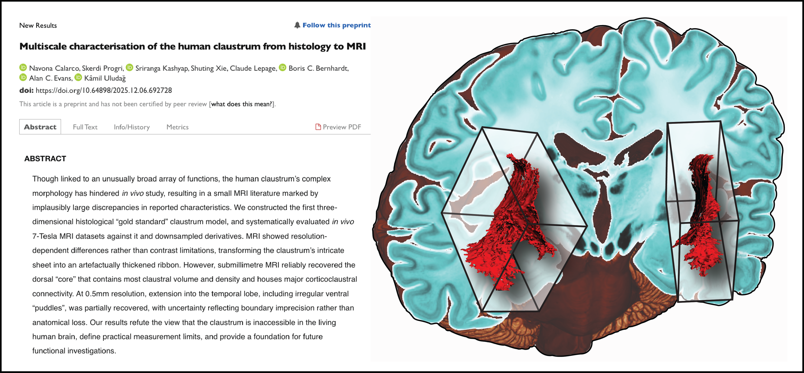

<p align="center">
  <a href="https://www.biorxiv.org/content/10.64898/2025.12.06.692728v1">
    
  </a>
  <br/>
  <em>Click to read the preprint →</em> <a href="https://www.biorxiv.org/content/10.64898/2025.12.06.692728v1"><strong>bioRxiv 2025.12.06.692728</strong></a>
</p>

---

<h1 align="center">Multiscale characterisation of the human claustrum<br>from histology to MRI</h1>

<p align="center">
Navona Calarco &nbsp;·&nbsp; Skerdi Progri &nbsp;·&nbsp; Sriranga Kashyap &nbsp;·&nbsp; Shuting Xie<br>
Claude Lepage &nbsp;·&nbsp; Boris C. Bernhardt &nbsp;·&nbsp; Alan C. Evans &nbsp;·&nbsp; Kâmil Uludağ
</p>

---

## About

This repository contains the data accompanying our paper on the human claustrum. We provide the manual histological segmentation of the claustrum derived from the *BigBrain* dataset (n=1) at 100 µm isotropic resolution — the highest-resolution reconstruction of this structure available. We also provide a cross-modality probabilistic atlas (n=13) registered to MNI space at 0.5 mm isotropic, integrating segmentations spanning histology, ex vivo MRI, and in vivo 7T MRI. 

---

## BigBrain segmentation

Our "gold-standard" segmentation was derived from manual delineation of the claustrum in the *BigBrain* histological dataset at 100 µm isotropic resolution. This represents the primary reference used in our multiscale analyses.

<table>
  <thead>
    <tr>
      <th>File</th>
      <th>Resolution</th>
      <th>Type</th>
      <th>Hemisphere</th>
      <th>Description</th>
    </tr>
  </thead>
  <tbody>
    <tr>
      <td><code>BigBrain/bigbrain_100um_CROPPED-LEFT.nii.gz</code></td>
      <td>100 µm</td>
      <td>intensity</td>
      <td>left</td>
      <td>Cropped intensity image underlying left segmentation</td>
    </tr>
    <tr>
      <td><code>BigBrain/bigbrain_100um_CROPPED-RIGHT.nii.gz</code></td>
      <td>100 µm</td>
      <td>intensity</td>
      <td>right</td>
      <td>Cropped intensity image underlying right segmentation</td>
    </tr>
    <tr>
      <td><code>BigBrain/claustrumSeg_LEFT.nii.gz</code></td>
      <td>100 µm</td>
      <td>segmentation</td>
      <td>left</td>
      <td>Manual segmentation, left hemisphere, cropped</td>
    </tr>
    <tr>
      <td><code>BigBrain/claustrumSeg_RIGHT.nii.gz</code></td>
      <td>100 µm</td>
      <td>segmentation</td>
      <td>right</td>
      <td>Manual segmentation, right hemisphere, cropped</td>
    </tr>
    <tr>
      <td><code>BigBrain/claustrumSeg_combined_uncropped.nii.gz</code></td>
      <td>100 µm</td>
      <td>segmentation</td>
      <td>bilateral</td>
      <td>Combined segmentations in full BigBrain dimensions</td>
    </tr>
  </tbody>
</table>

> **Note:** The full-resolution BigBrain intensity volume underlying the combined segmentation is too large for GitHub and can be accessed via [LORIS](https://bigbrain.loris.ca/main.php?test_name=brainvolumes&release=2015) (2.9 GB).

---

## MRI segmentations

Manual claustrum segmentations from three in vivo 7-Tesla MRI datasets are provided in
`MRI/segmentations/`, organised by resolution. Segmentations were performed in each subject's native space.

| Dataset | Resolution | N | Source |
| --- | --- | --- | --- |
| `MRI/segmentations/0p5/` | 0.5 mm isotropic | 10 | [Cabalo et al. (2025)](https://doi.org/10.1038/s41597-025-04863-7) |
| `MRI/segmentations/0p7/` | 0.7 mm isotropic | 10 | [Haast et al. (2024)](https://doi.org/10.1073/pnas.2310044121) |
| `MRI/segmentations/1p0/` | 1.0 mm isotropic | 10 | [Kashyap et al. (2018)](https://doi.org/10.1016/j.neuroimage.2017.07.022) |

---

## Probabilistic atlas

The cross-modality probabilistic atlas is registered to MNI152 space at 0.5 mm isotropic resolution. It was constructed by integrating 13 segmentations from four datasets spanning histology, ex vivo MRI, and in vivo 7T MRI.

<table>
  <thead>
    <tr>
      <th>File</th>
      <th>Resolution</th>
      <th>Type</th>
      <th>Hemisphere</th>
      <th>Description</th>
    </tr>
  </thead>
  <tbody>
    <tr>
      <td><code>atlas/mni_icbm152_t1_tal_nlin_sym_09b.nii.gz</code></td>
      <td>500 µm</td>
      <td>intensity</td>
      <td>bilateral</td>
      <td>MNI152 template</td>
    </tr>
    <tr>
      <td><code>atlas/claustrum_prob_weighted.nii.gz</code></td>
      <td>500 µm</td>
      <td>segmentation</td>
      <td>bilateral</td>
      <td>Cross-modality probabilistic atlas in MNI space</td>
    </tr>
  </tbody>
</table>

### Atlas construction

<table>
  <thead>
    <tr>
      <th>N</th>
      <th>Dataset</th>
      <th>Resolution</th>
      <th>Modality</th>
      <th>Acquisition</th>
      <th>Segmenter</th>
      <th>Subject(s)</th>
    </tr>
  </thead>
  <tbody>
    <tr>
      <td>1</td>
      <td><a href="https://bigbrain.loris.ca/main.php?">BigBrain</a></td>
      <td>100 µm</td>
      <td>Histology</td>
      <td>Ex vivo</td>
      <td>Calarco et al.</td>
      <td>1</td>
    </tr>
    <tr>
      <td>1</td>
      <td><a href="https://openneuro.org/datasets/ds002179/versions/1.1.0">Edlow</a></td>
      <td>100 µm</td>
      <td>MRI</td>
      <td>Ex vivo</td>
      <td>Mauri et al. (2025)†</td>
      <td>1</td>
    </tr>
    <tr>
      <td>1</td>
      <td><a href="https://datadryad.org/dataset/doi:10.5061/dryad.38s74">Lüsebrink</a></td>
      <td>250 µm</td>
      <td>MRI</td>
      <td>In vivo</td>
      <td>Mauri et al. (2025)†</td>
      <td>1</td>
    </tr>
    <tr>
      <td>10</td>
      <td><a href="https://osf.io/mhq3f/overview">MICA-PNI</a></td>
      <td>500 µm</td>
      <td>MRI</td>
      <td>In vivo</td>
      <td>Calarco et al.</td>
      <td>10</td>
    </tr>
  </tbody>
</table>

† The Edlow and Lüsebrink dataset segmentations were made publicly available by [Mauri et al. (2025)](https://github.com/chiara-mauri/claustrum_segmentation) as part of their publication:

> Mauri C, Fritz R, Mora J, Billot B, Iglesias JE, Van Leemput K, Augustinack J, Greve DN. A contrast-agnostic method for ultra-high resolution claustrum segmentation. *Human Brain Mapping*. 2025. doi:[10.1002/hbm.70303](https://doi.org/10.1002/hbm.70303)

---

## Citation

If you use these data, please cite:

```bibtex
@article{calarco2025claustrum,
  title   = {Multiscale characterisation of the human claustrum from histology to MRI},
  author  = {Calarco, Navona and Progri, Skerdi and Kashyap, Sriranga and
             Xie, Shuting and Lepage, Claude and Bernhardt, Boris C. and
             Evans, Alan C. and Uludag, Kamil},
  year    = {2025},
  note    = {Preprint},
  url     = {https://www.biorxiv.org/content/10.64898/2025.12.06.692728v1}
}
```

---

## License

Data are licensed under [CC BY 4.0](https://creativecommons.org/licenses/by/4.0/). Code is licensed under the [MIT License](LICENSE-code).

---

## Contact

**Navona Calarco**  
PhD Candidate, Medical Biophysics, University of Toronto  
BRAIN-TO Lab, Krembil Brain Institute, UHN  
[navona.calarco@mail.utoronto.ca](mailto:navona.calarco@mail.utoronto.ca)

---

<p align="center">
<sub><a href="https://brain-to.github.io/">BRAIN-TO Laboratory</a> &nbsp;·&nbsp; Krembil Brain Institute &nbsp;·&nbsp; UHN &nbsp;·&nbsp; 2025</sub>
</p>
